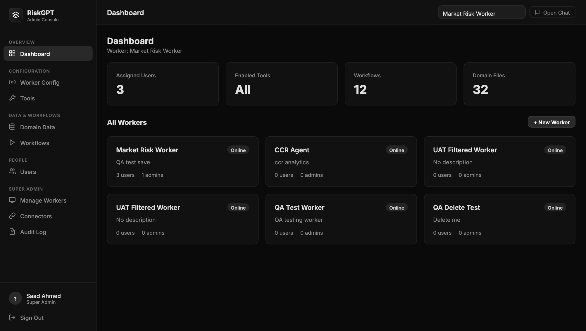
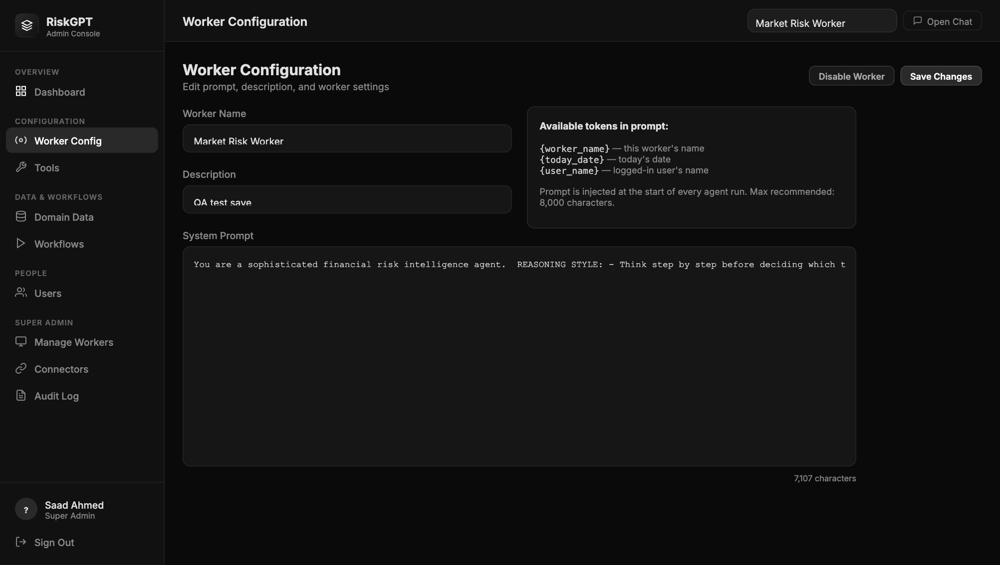
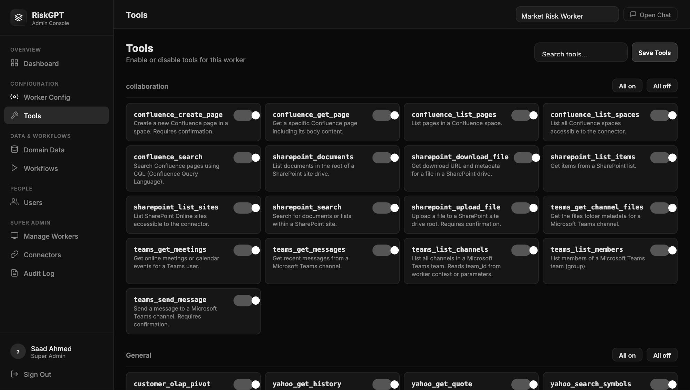
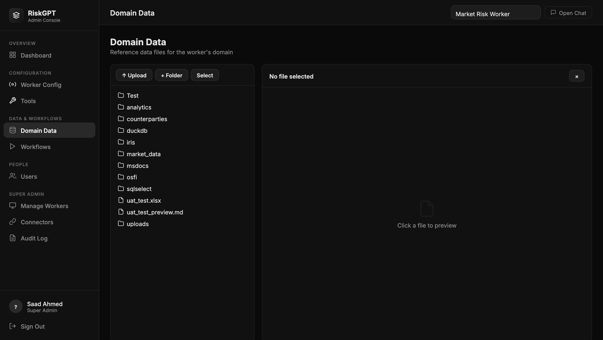
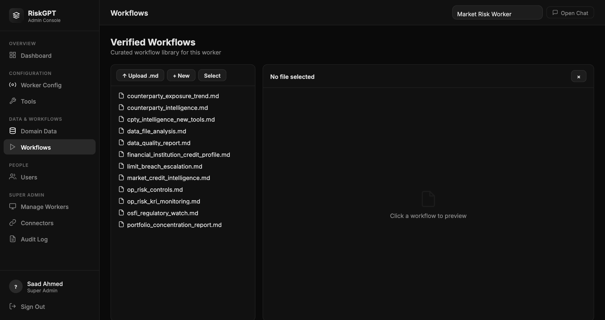
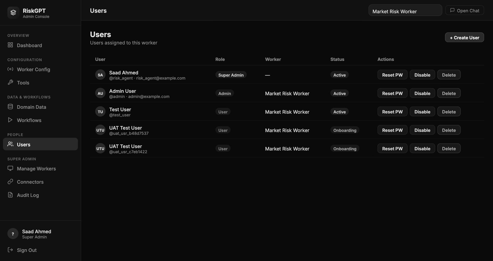

# B-Pulse Digital Workers

> **Source:** Converted from `Admin_User_Guide.docx` on 2026-05-17. Diagrams and embedded images are summarised in prose; original .docx is no longer in the active tree (see git history if needed).

---

**B-Pulse Digital Workers**

**Admin User Guide**

Worker Administration for Team Leads

April 2026

*Audience: Team Administrators*

**Welcome**

As a Team Administrator on B-Pulse Digital Workers, you manage the day-to-day configuration of your Digital Worker — keeping data fresh, managing workflows, and supporting your team members. This guide shows you exactly what you can do and how. You have admin access scoped to your assigned worker only. For platform-wide changes (creating new workers, connector credentials, adding admins), contact your Super Admin.

|  |
|----|
| Your account is linked to one worker. Everything you see in the Admin Console relates to that worker only. |

**1. Signing In**

Open your browser and navigate to the Admin Console URL (e.g. http://localhost:8000/admin.html). Enter your username and password and click Sign In.

*Sign in with your admin credentials*

After signing in, you will see the Dashboard for your worker.

*Dashboard — your worker's overview at a glance*

The four stat cards show: how many users are on your team (Assigned Users), how many AI capabilities are turned on (Enabled Tools), how many saved analysis sequences exist (Workflows), and how many data files your worker can read (Domain Files).

**2. Worker Settings**

Click Worker Config in the left sidebar to view and update your worker's name and description.

*Worker Config — basic settings for your Digital Worker*

- Edit the worker name or description to reflect the team's current focus

- Click Save Changes to apply

- The Worker ID, connector scope, and tool assignments at the platform level can only be changed by a Super Admin

**3. Managing AI Tools**

Click Tools in the sidebar to see the full list of AI capabilities available to your worker. As an admin, you can enable or disable individual tools depending on what your team needs.

*Tools library — toggle capabilities on or off for your worker*

**What each tool category does:**

|  |  |
|----|----|
| **Tool Category** | **What it enables the AI to do** |
| Microsoft Teams | Read channel messages, post updates, check meeting schedules |
| Microsoft Outlook | Read the team inbox, reply to emails, send new messages on your behalf |
| Atlassian Confluence | Search and read your space, create and update pages |
| Atlassian Jira | Create tickets, update issues, add comments, check sprint boards |
| Market Data | Fetch live stock quotes, indices, rates from exchanges and central banks |
| CCR / Counterparty | Query counterparty exposure, credit limits, VaR contribution |
| OSFI Regulatory | Search and read OSFI regulatory guidance documents |
| SEC / EDGAR | Retrieve earnings reports, MD&A, risk factors for public companies |
| Domain Data | Read uploaded files (your CSV, Excel, PDF data files) |
| Workflows | Run saved analysis sequences |

- Toggle each tool on or off with the switch

- Click Save Tools after making any changes

- Changes take effect immediately — no restart or re-login needed

|  |
|----|
| If a team member says the AI "cannot" do something it should be able to do, check the Tools page — the relevant tool may be switched off. |

**4. Domain Data — Your Knowledge Base**

The Domain Data section is where you manage the files your Digital Worker reads from. Think of it as the AI's library. The more current and relevant the files you upload, the better the AI's answers will be.

*Domain Data — file tree with upload and folder management*

**4.1 Uploading Files**

- 1\. In the file tree, navigate to the correct subfolder (e.g. reports/ or counterparties/)

- 2\. Click the Upload button in the toolbar

- 3\. Select one or more files from your computer

- 4\. Wait for the confirmation message — the file is immediately available

Supported formats: CSV, Excel (.xlsx), PDF, Word (.docx), plain text (.txt), Markdown (.md)

**4.2 Organising with Folders**

- Click + Folder to create a new subfolder

- Drag files between folders (or use the Move option in the context menu)

**4.3 Recommended Folder Structure**

|  |  |
|----|----|
| **Folder** | **What to Store Here** |
| counterparties/ | Counterparty exposure files, credit limit sheets, trade inventories |
| reports/ | Daily / weekly risk reports for the AI to reference |
| regulatory/ | OSFI guidance, internal policy documents, Basel requirements |
| templates/ | Standard report templates the AI should use when drafting outputs |
| archive/ | Older versions of files kept for historical reference |

**5. Workflows**

Workflows are pre-written AI instruction sequences for repeatable analyses. Examples: "Daily CCR Report", "Counterparty Limit Breach Summary", "Weekly VaR Attribution". End users can run these with a single click from the chat interface.

*Workflows — verified analysis sequences your team can run on demand*

- Click a workflow to preview its steps and purpose

- Verified workflows (marked with a tick) are available to all users on your worker

- To create new workflows: use the chat interface and save a successful analysis as a workflow — contact your Super Admin for help with this process

**6. Your Team Members**

Click Users in the sidebar to see who is assigned to your worker.

*Users — team members assigned to your worker*

- You can see each user's display name, role, and last login time

- To add a new team member: contact your Super Admin — they will create the account and assign it to your worker

- If a user is locked out: use the Reset Password option next to their name (if available for your role)

**7. Quick Reference**

|  |  |
|----|----|
| **Task** | **Where** |
| Update worker name / description | Worker Config → Save Changes |
| Enable or disable a tool | Tools → toggle switch → Save Tools |
| Upload a new data file | Domain Data → navigate to folder → Upload |
| Create a subfolder for data files | Domain Data → + Folder |
| View available workflows | Workflows |
| See who is on your team | Users |
| Add a new team member | Contact your Super Admin |
| Configure connector credentials | Contact your Super Admin (Connectors section) |
| View audit / tool call log | Contact your Super Admin (Audit Log section) |
