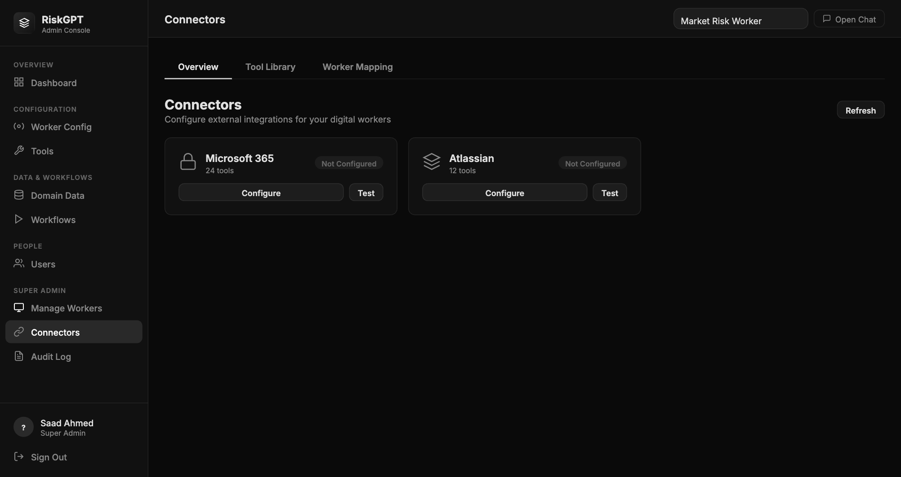

# B-Pulse Digital Workers

> **Source:** Converted from `Connectors_Guide.docx` on 2026-05-17. Diagrams and embedded images are summarised in prose; original .docx is no longer in the active tree (see git history if needed).

---

**B-Pulse Digital Workers**

**Connectors Guide**

Configuration & Credentials by Digital Worker

April 2026

*Audience: Administrators & IT Teams*

**1. Overview**

B-Pulse Digital Workers integrates with Microsoft 365 (Teams, Outlook) and Atlassian (Confluence, Jira) to enable AI-driven communication and documentation workflows. This guide covers the connector credentials required and the step-by-step setup in the Admin Console.

|  |
|----|
| Connector credentials grant the AI agent the ability to read and write on behalf of your organisation. Ensure all credentials have the minimum permissions described below and are stored securely. |

**2. Microsoft 365 Connector**

**2.1 Credential Requirements**

The Microsoft 365 connector uses OAuth2 Client Credentials Flow (app-level permissions). An Azure AD App Registration is required.

|  |  |  |
|----|----|----|
| **Credential** | **Where to Find** | **Notes** |
| Tenant ID | Azure Portal → Azure Active Directory → Overview → Tenant ID | A GUID (xxxxxxxx-xxxx-xxxx-xxxx-xxxxxxxxxxxx) |
| Application (Client) ID | Azure Portal → App registrations → your app → Overview | A GUID |
| Client Secret | Azure Portal → App registrations → your app → Certificates & secrets | Create a new secret; copy the value immediately — it is only shown once |

**2.2 Required API Permissions (Application)**

In Azure Portal → App registrations → your app → API permissions, add the following as Application permissions and grant Admin consent:

|                         |                                                |
|-------------------------|------------------------------------------------|
| **Permission**          | **Required For**                               |
| Mail.Read               | Reading emails (Outlook read tools)            |
| Mail.Send               | Sending emails (Outlook send tool)             |
| Mail.ReadWrite          | Replying to emails, managing folders           |
| Calendars.Read          | Reading meeting schedules (teams_get_meetings) |
| Team.ReadBasic.All      | Listing teams and channels                     |
| ChannelMessage.Read.All | Reading Teams channel messages                 |
| ChannelMessage.Send     | Posting messages to Teams channels             |
| Files.Read.All          | Reading files shared in channels               |

|  |
|----|
| All permissions must be Application (not Delegated) permissions. Admin consent must be granted by an Azure Global Administrator before any tools will function. |

**2.3 Worker Scope Values**

After the connector is configured, each Digital Worker needs a scope that limits which Teams channel and Outlook mailbox it can access:

|  |  |  |
|----|----|----|
| **Field** | **Description** | **How to Find** |
| Teams Team ID | GUID of the Microsoft Team for this worker | Teams → right-click team → Get link to team → extract object ID from URL |
| Outlook User Email | Email address of the mailbox this worker reads/sends from | The shared mailbox address, e.g. mrrisk@company.com |
| SharePoint Site URL | Optional: SharePoint site for file access | Navigate to the site; copy URL up to /sites/{name} |

*Connectors page — Admin Console*

**3. Atlassian Connector**

**3.1 Credential Requirements**

The Atlassian connector uses HTTP Basic authentication with a personal API token. A dedicated service account (not a personal user account) is strongly recommended for production.

|  |  |  |
|----|----|----|
| **Credential** | **Where to Find** | **Notes** |
| Atlassian Email | Email of the Atlassian account used for API auth | Recommend a service account: bpulse-agent@company.com |
| API Token | https://id.atlassian.com → Security → Create and manage API tokens | Label it "B-Pulse MCP Server"; copy value immediately |
| Confluence Base URL | Your Confluence site | https://yourcompany.atlassian.net (no /wiki suffix) |
| Jira Base URL | Your Jira site | https://yourcompany.atlassian.net |

**3.2 Required Atlassian Permissions**

- Confluence: Can View space, Add Page, Edit Page for the target space

- Jira: Browse Projects, Create Issues, Edit Issues, Add Comments for the target project

- Jira: View Board, Manage Sprints (required if sprint management tools are enabled)

**3.3 Worker Scope Values**

|  |  |  |
|----|----|----|
| **Field** | **Description** | **How to Find** |
| Confluence Space Key | Key identifying the target Confluence space | Go to the space; URL shows /wiki/spaces/{SPACE_KEY}/ |
| Jira Project Key | Key identifying the target Jira project | Visible in issue IDs: MRISK-123 → key is MRISK |
| Jira Board ID | Numeric board ID for sprint queries | Navigate to board → URL shows /boards/{BOARD_ID} |
| Confluence Parent Page ID | Numeric ID of parent page for new pages created by the agent | Navigate to the page → URL shows /pages/{PAGE_ID} |

**4. Connector Configuration in Admin Console**

**4.1 Step-by-Step: Microsoft 365**

- 1\. Log into Admin Console as a super_admin user

- 2\. Click Connectors in the left sidebar

- 3\. On the Overview tab, click Configure on the Microsoft 365 card

- 4\. Enter: Display Name, Tenant ID, Application (Client) ID, and Client Secret

- 5\. Click Test Connection — wait for the green success confirmation

- 6\. Click Save — the card will now show status: Connected

**4.2 Step-by-Step: Atlassian**

- 1\. In Connectors → Overview, click Configure on the Atlassian card

- 2\. Enter: Display Name, Email, API Token, Confluence URL, Jira URL

- 3\. Click Test Connection → green success

- 4\. Click Save

**4.3 Assigning Scope to a Worker**

- 1\. Click the Worker Mapping tab in the Connectors section

- 2\. Select the target worker from the dropdown (e.g. Market Risk Worker)

- 3\. Enter Microsoft 365 scope: Teams Team ID, Outlook email, optional SharePoint URL

- 4\. Click Save Microsoft 365 Scope

- 5\. Enter Atlassian scope: Space Key, Project Key, Board ID, Parent Page ID

- 6\. Click Save Atlassian Scope

- 7\. Verify the worker's connector_scope in Admin Console → Worker Config — it should now show real values, not the placeholder qa-team / RISK / CCR defaults

**5. Connector Requirements by Digital Worker**

|  |  |  |  |  |  |
|----|----|----|----|----|----|
| **Digital Worker** | **Teams** | **Outlook** | **Confluence** | **Jira** | **Notes** |
| Market Risk Worker | Required | Required | Required | Required | Full connector suite; primary production worker |
| CCR Agent | Optional | Optional | Required | Optional | Primarily Confluence for regulatory documentation |

**6. Security Notes**

- Store credentials in the Admin Console only — never in .env files or source control

- Rotate Microsoft 365 Client Secrets every 90 days (Azure enforces this by default)

- Rotate Atlassian API tokens every 180 days

- Use a dedicated Atlassian service account, not a personal user account

- BUG-CONN-001: Credentials are currently stored plaintext in config/connectors.json — do not commit this file to git; AES-256-GCM encryption is planned in REQ-07

- The agent only acts within the connector_scope defined for each worker — it cannot access Teams channels or Confluence spaces outside its assigned scope
