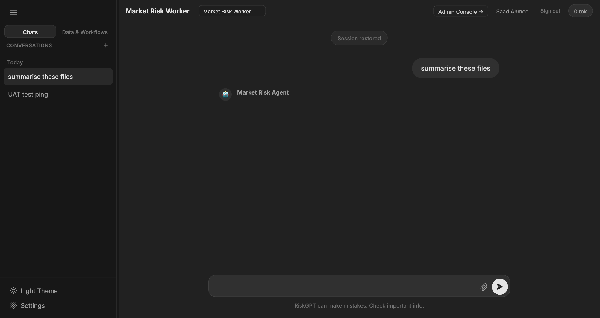

# B-Pulse Digital Workers

> **Source:** Converted from `End_User_Guide_Market_Risk.docx` on 2026-05-17. Diagrams and embedded images are summarised in prose; original .docx is no longer in the active tree (see git history if needed).

---

**B-Pulse Digital Workers**

**Market Risk Analyst Guide**

How to Work with Your Digital Worker

April 2026

*Audience: Market Risk Team — End Users*

**Welcome**

Your team now has a B-Pulse Digital Worker — an AI assistant that understands market risk, knows your counterparty data, can read your reports, and can communicate with your team on Teams and Confluence. This guide will show you, step by step, how to get the most out of it.

You do not need any technical knowledge to use B-Pulse. Just type your questions the same way you would ask a knowledgeable colleague, and the AI will do the heavy lifting.

|  |
|----|
| The AI works best when you give it context. Instead of "what is the VaR?" try "what is the 1-day 99% VaR for counterparty HSBC as of yesterday?" |

**1. Opening the Digital Worker**

Your administrator will give you the URL to your Digital Worker. Open it in any browser (Chrome recommended). If you are not already logged in, you will see the sign-in page.

*Sign in with the credentials your admin provided*

- Enter your Username and Password (provided by your admin)

- Click Sign In

- If this is your first login, you may be asked to change your password

**1.1 The Chat Interface**

*The Market Risk Digital Worker — your main workspace*

The interface has three main areas:

- Left panel — your conversation history (past chats are saved and can be resumed)

- Centre — the chat window where you type questions and see answers

- Right panel — domain data file tree and workflow shortcuts

**2. Asking Your First Questions**

Click the message box at the bottom and type your question. Press Enter or click the Send button. The AI will think, call the relevant tools, and reply — usually in 5–20 seconds.

**2.1 Good Question Examples**

|  |  |
|----|----|
| **You want to know...** | **Try asking...** |
| Counterparty exposure | "What is our current credit exposure to Bank of America? Show me the breakdown by trade type." |
| Limit utilisation | "Which counterparties are above 80% of their credit limit today?" |
| VaR summary | "Give me a summary of VaR contribution by top 5 counterparties." |
| Market data | "What is the current 10-year US Treasury yield and how has it moved this week?" |
| Regulatory context | "What does OSFI say about counterparty credit risk mitigation under guideline B-20?" |
| Company research | "Give me a summary of Goldman Sachs' most recent earnings, focusing on FICC revenue." |
| Teams messages | "What were the key discussion points in the Market Risk channel this week?" |
| Confluence page | "Find the counterparty onboarding policy in our Confluence space." |
| Jira ticket | "Create a Jira ticket in the MRISK project: 'Review HSBC credit limit — approaching threshold'." |
| Email summary | "Summarise any unread emails in the risk inbox from the last 24 hours." |

**2.2 Tips for Better Answers**

- Be specific — name the counterparty, date range, or product type

- Include the time period — "as of today", "for Q4 2025", "year to date"

- Say what format you want — "as a table", "in bullet points", "as a brief paragraph"

- If the answer is not quite right, follow up: "Can you break that down by currency?" or "Show only counterparties above 500M exposure"

- You can ask multiple things in one message: "What is our top 5 CCR exposure today and which ones are near the credit limit?"

**3. Actions That Require Your Approval**

The AI can send messages, create tickets, and post pages on your behalf — but it will ALWAYS ask for your confirmation before doing so. You will see a confirmation box like this:

|  |
|----|
| Example: "I am about to post the following message to the \#market-risk-alerts Teams channel. Do you approve? \[Yes / No\]" |

- Read the proposed action carefully before clicking Yes

- If you click No, the action is cancelled — nothing is sent

- You can modify your request: "Change the wording to... then send it"

**Actions that require confirmation:**

- Sending a Teams message to a channel

- Sending or replying to an email

- Creating or updating a Jira ticket

- Creating or editing a Confluence page

**4. Using Saved Workflows**

Your admin has set up saved workflows for common analyses — for example, the Daily CCR Summary or Counterparty Limit Breach Report. Instead of typing a complex question each time, you can run a workflow with one click.

- Look for the Workflows panel in the right sidebar of the chat screen

- Click a workflow name to start it

- The AI will run the full analysis sequence automatically

- You can still ask follow-up questions after a workflow completes

|  |
|----|
| Ask your admin to save a useful analysis as a workflow so the whole team can reuse it with one click. |

**5. Uploading Your Own Files**

You can upload your own data files (Excel, CSV, PDF) directly in the chat for the AI to read and analyse. Your uploaded files are private to you — other users cannot see them.

- Click the paperclip / upload icon in the chat input area

- Select your file (e.g. a counterparty exposure Excel from your desktop)

- Once uploaded, you can ask: "Analyse the exposure data I just uploaded and identify any breaches"

|  |
|----|
| Uploaded files are stored in your personal folder. They are not shared with other users or workers unless your admin moves them to the shared domain data area. |

**6. Your Conversation History**

Every chat session is saved automatically. You can pick up where you left off or review past analyses at any time.

- Past conversations appear in the left sidebar

- Click any conversation to resume it — the AI remembers the full context

- Start a fresh conversation with the + New Chat button at the top of the sidebar

|  |
|----|
| Conversation history is stored only for the duration of the server session. If the server is restarted by IT, history will be cleared. Save important outputs to Confluence or email before logging off. |

**7. Sample Analysis Scenarios**

Here are some real-world scenarios to show you the power of your Digital Worker:

**Scenario A: Morning CCR Briefing**

- You: "Give me a morning briefing on our top 10 counterparty exposures, any limit breaches, and the 1-day VaR summary."

- AI: Pulls live CCR data, checks limits, summarises VaR — all in one response in under 30 seconds

**Scenario B: Regulatory Query**

- You: "What does OSFI guideline B-20 say about stress testing requirements for counterparty credit risk?"

- AI: Searches the OSFI document library and provides a precise answer with the relevant section quoted

**Scenario C: Escalating a Breach via Teams**

- You: "HSBC is above 90% of their credit limit. Draft a message for the Market Risk Alerts channel and create a Jira ticket."

- AI: Drafts both, shows you the content, asks for your approval, then posts once you confirm

**Scenario D: Earnings Research**

- You: "Summarise JPMorgan's Q4 2025 earnings with a focus on trading revenue and risk provisions."

- AI: Retrieves the SEC filing, extracts the relevant sections, and provides a structured summary

**8. Getting Help**

|  |  |
|----|----|
| **Issue** | **What to Do** |
| AI gives a wrong or incomplete answer | Clarify: "That's not right — the exposure should include all derivatives. Try again with that context." |
| AI says it cannot access a tool | Contact your admin — the relevant tool may be disabled |
| Login problems | Contact your admin to reset your password |
| AI is slow or not responding | Wait 30 seconds and try again; contact IT if it persists |
| You need a new workflow added | Ask your admin to create and save it |
| You want to share an AI output with your team | Ask the AI to "post this to our Confluence space" or "email this to the team" |
