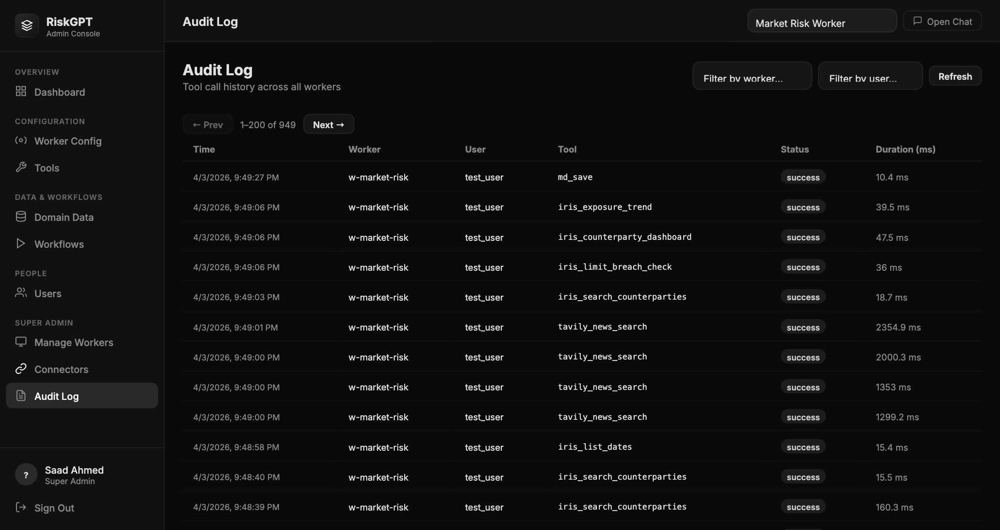

# B-Pulse Digital Workers

> **Source:** Converted from `Super_Admin_Guide.docx` on 2026-05-17. Diagrams and embedded images are summarised in prose; original .docx is no longer in the active tree (see git history if needed).

---

**B-Pulse Digital Workers**

**Super Admin Guide**

Full Platform Administration

April 2026

*Audience: Super Administrators*

**Welcome to the Admin Console**

As a Super Admin, you have full control over the B-Pulse Digital Workers platform. This guide walks you through everything: creating and managing Digital Workers, adding users, uploading data, configuring connectors, and monitoring the audit trail. You access everything from the Admin Console — a web interface that opens in your browser.

|  |
|----|
| Super Admin is the highest role on the platform. You can see and do everything. Guard your credentials carefully. |

**1. Signing In**

Open your browser and go to the Admin Console URL (e.g. http://localhost:8000/admin.html). You will see the login screen.

*The B-Pulse login screen*

- Enter your Username (e.g. risk_agent)

- Enter your Password

- Click Sign In

- You land on the Admin Console Dashboard

*Admin Console Dashboard — showing worker statistics and all active Digital Workers*

The Dashboard shows statistics for the currently selected worker (top-right dropdown): Assigned Users, Enabled Tools, Workflows, and Domain Files. Scroll down to see cards for every Digital Worker on the platform.

**2. Managing Digital Workers**

**2.1 What Is a Digital Worker?**

A Digital Worker is a specialist AI agent built for a specific team or function. Each worker has its own tools, data files, connector scope (which Teams channel, Confluence space, and Jira project it can access), and assigned users. Examples: Market Risk Worker, CCR Agent.

**2.2 Viewing All Workers**

The Dashboard shows a card for every worker. The card displays the worker name, status (Online/Offline), number of assigned users and admins. Use the + New Worker button to create a new one.

**2.3 Creating a New Worker**

- 1\. On the Dashboard, click + New Worker (top right)

- 2\. Fill in: Worker Name (e.g. "Credit Risk Worker"), Description, Worker ID (lowercase + hyphens only, e.g. w-credit-risk)

- 3\. Click Create Worker

- 4\. A new card appears on the Dashboard with status Online

**2.4 Worker Config — Settings**

Select a worker from the top-right dropdown then click Worker Config in the sidebar to update its name, description, and settings.

*Worker Config — name, description, and settings for the selected worker*

- Edit the name or description and click Save Changes

- You can also disable a worker here (Disable Worker button) — it stays in the system but cannot be used by team members

**2.5 Managing Worker Tools**

Click Tools in the sidebar to see all 74+ available tools. Toggle individual tools on or off for the current worker — for example, disable Teams tools if a worker should not be able to post messages.

*Tools page — toggle individual AI capabilities on or off per worker*

- Use the toggle switches to enable or disable individual tools

- Bulk controls let you enable or disable all tools at once

- Click Save Tools — changes take effect immediately, no restart needed

**3. User Management**

Click Users in the sidebar to see all platform users, their roles, assigned workers, and last login time.

*Users page — all platform users with role and worker assignment*

**3.1 Adding a New User**

- 1\. Click + Add User

- 2\. Enter: Username, Display Name, Email, Role, and initial Password

- 3\. If the role is admin or user, assign them to a Worker

- 4\. Click Create User

- 5\. Share the credentials with the user — they should change their password on first login

**3.2 Roles Explained**

|  |  |
|----|----|
| **Role** | **Capabilities** |
| Super Admin | Full access: create workers, manage all users, configure connectors, view all audit logs, manage domain data for any worker |
| Admin | Worker-scoped: manage tools, domain data, and workflows for their assigned worker; manage users within that worker; cannot create new workers or connectors |
| User | End-user access only: use the chat interface, view workflows, upload personal files; no admin console access |

**4. Domain Data & Workflows**

**4.1 Domain Data**

Domain Data is the knowledge base the AI reads from — CSV files, Excel reports, PDFs, regulatory documents, and any other files your team needs. Click Domain Data in the sidebar to manage it.

*Domain Data — file tree showing all documents available to the worker*

- Navigate folders using the tree on the left

- Click a file to preview its contents on the right

- Click Upload to add new files (CSV, Excel, PDF, Word, text)

- Click + Folder to create a new subfolder for organisation

- Files are available to the AI immediately after upload

**4.2 Workflows**

Workflows are saved AI instruction sequences for repeatable analyses — like "Daily CCR Summary" or "Counterparty Limit Breach Report". Click Workflows to manage them.

*Workflows — verified analysis sequences available to end users*

**5. Connectors**

Click Connectors in the sidebar to manage Microsoft 365 and Atlassian integrations. See the Connectors Guide for full setup instructions.

*Connectors — Overview tab showing Microsoft 365 and Atlassian configuration status*

- Overview tab: Configure connector credentials and test the connection

- Worker Mapping tab: Assign specific Teams channels, Confluence spaces, and Jira projects to each worker

- A green Connected badge confirms the integration is live

**6. Audit Log**

The Audit Log is your compliance record. Every tool call made by every user across all workers is logged here. Click Audit Log in the sidebar.

*Audit Log — complete record of all tool calls, approvals, and write operations*

- Filter by user, worker, tool name, or date range

- Write operations (sending Teams messages, emails, creating Jira tickets) show confirmation_required: true — confirming a human approved the action

- Export the log for compliance reporting

- The log is stored as an append-only file — it cannot be edited or deleted from the UI

**7. Quick Reference**

|  |  |  |
|----|----|----|
| **Task** | **Where to Go** | **Action** |
| Create a new Digital Worker | Dashboard | Click + New Worker; fill in name & ID |
| Add a user to the platform | Users | Click + Add User; set role & worker |
| Enable / disable tools | Tools (select worker) | Toggle switches; click Save Tools |
| Upload a domain data file | Domain Data | Navigate to folder; click Upload |
| Configure Microsoft 365 | Connectors → Overview | Click Configure on MS365 card; enter Tenant ID, Client ID, Secret |
| Configure Atlassian | Connectors → Overview | Click Configure on Atlassian card; enter email, API token |
| Assign connector scope to worker | Connectors → Worker Mapping | Select worker; enter IDs/keys; click Save |
| Review the compliance audit trail | Audit Log | Filter by date, user, or tool; export as needed |
| Change worker description | Worker Config | Edit fields; click Save Changes |
| Disable a worker temporarily | Worker Config | Click Disable Worker button |
